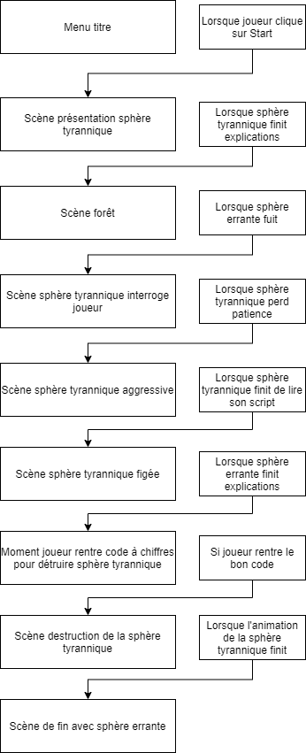

# Tyrannie sphérique

## Description
 
Une expérience de VR faite avec Unity et disponible sur le Web. Dans cette expérience, le visiteur devra faire face à une Sphère tyrannique qui, plus tard, se montrera hostile et avec une aide inattendue, le joueur mettra fin à cette tyrannnie.
 
 
 

# Roadmap

## Milestone 1: Créer le nombre de scène nécessaire pour le scénario du projet.

* Préparer le projet Unity.

* Créer toutes les scènes nécessaire selon le scénario.

* Ajouter les scènes dans le Build Settings pour les associés à un index.

 
 

## Milestone 2: Coder des touches du clavier pour naviguer à travers les scènes plus rapidement.

* Créer un GameObject vide qui contrôlera le changement des scènes.

* Coder le changement des scènes en utilisant le système SceneManagement d'Unity.

* Tester les changements de scène

 
 

## Milestone 3: Décorer les scènes en scènes primitives et version alpha.

* Modeler les éléments 3D dans Maya.

* Appliquer des matériaux placeholder à des fins de présentation.

* Exporter les modèles 3D en FBX, puis les importer dans Unity.

* Positionner les modèles 3D dans leurs scènes respectives.

 
 

## Milestone 4: Ajouter Particules de pluie pour la scène de la forêt.

* Ajouter un effet de pluie non final grâce au système de particule d'Unity.

 
 

## Milestone 5: Ajouter brume pour la scène de la forêt.

* Ajouter un effet de brume non final grâce au système de particule d'Unity.

 
 

## Milestone 6: Ajouter musique composée par moi-même pour scène de la forêt.

* Lister le nombre de scène et leur contexte où une musique personnalisée est dû.

* Composer les musiques dans Mixcraft 9 Pro.

* Intégrer les musiques composées dans Unity.

 
 

## Milestone 7: Importer objets 3D primitifs animés pour scènes impliquées.

* Modeler les 2 sphères 3D de l'histoire (sphère tyrannique et sphère amicale).

* Animer en version non final la ou les sphère amicale dans Maya.

* Exporter la ou les sphères amicaux en FBX, puis l'importer dans Unity.

* Intégrer la ou les sphères amicaux dans sa ou leurs scènes respectives.

 
 

## Milestone 8: Tester l’assemblage global.

* Contrôler la qualité du déroulement de l'histoire du projet.

* Contrôler la qualité de l'apparition de l'audio.

* Contrôler la qualité de l'animation.

* Contrôler la qualité des particules.

* Contrôler la qualité des textures.

* Une fois tous les tests positifs, exporter le projet en WebXR.

* Recontrôler la qualité des points 1 à 5 sous la version WebXR du projet afin de contrôler la performance du projet. Si problématique rencontrée, changement des textures, particules ou autres afin d'y remédier.

# Bilan du projet Tyrannie sphérique

## Idée de départ

Ma première version de mon projet multimédia était une expérience de réalité virtuelle dans le grand studio du Collège Montmorency où le visiteur sera invité de s’assoir sur la chaise de la salle par une sphère inconnue projetée sur un mur dans une salle éclairée en bleu par des projecteurs. Après quelques informations, il devra enfiler un casque de réalité virtuelle se trouvant sur une table à sa portée. Une fois dans la réalité virtuelle, il sera transporté dans une forêt sous la pluie et la brume. Soudainement, une petite sphère errante apparaîtra et après quelques dialogues avec le visiteur elle prendra la fuite. Par la suite, le visiteur sera invité à retirer son casque et le remettre sur la table. La sphère tyrannique commencera alors à interroger le visiteur sur la rencontre imprévue entre le visiteur et la sphère errante. La tension montera rapidement et la sphère tyrannique deviendra de plus en plus agressive. Les lumières des projecteurs de la salle deviendront rouges. Tout à coup, la sphère tyrannique figera et la sphère errante apparaîtra sur la projection. Elle demandera l’aide du visiteur pour détruire la sphère tyrannique. Elle demandera qu’il renfile son casque de réalité virtuelle et devra chercher dans l’environnement des chiffres. Une fois tous les chiffres apparus, le visiteur devra rentrer la même séquence sur un clavier numérique qui sera sur la même table que le casque. Une fois le code bien entré, la sphère tyrannique se détruira en plusieurs explosions jusqu’à s’éteindre pour toujours. À la fin, la sphère errante remercie le visiteur et l’invite à sortir de la salle.

 
 

## Idée actuelle

Cependant, des contraintes surprises sont apparues en cours de route qui oblige le projet d’être accessible à distance. Donc, le projet conservera son scénario le plus possible, mais il deviendra un projet Unity accessible depuis le Web. Comme ça, avec les mesures sanitaires actuelles et imprévisibles en cours, il sera possible de présenter le projet depuis le Web, à distance et en toute sécurité.

 
 

## Structure du scénario

Le scénario est assez clair et structuré pour être à la fois facile de compréhension et pour s’y immerger sans trop de questions. En plus, étant donné que le projet sera disponible depuis le Web, il y aura peu de ressource matérielle nécessaire pour son déploiement et aucune ressource humaine ne devrait, en général, être nécessaire. 

 
 

## Inventaire des médias

Étant donné que mon projet n’a pas de médias ou de structures avancées finaux, il m’est impossible de présenter un scénarimage ou un inventaire de médias. De plus, pour les mêmes raisons, il est trop tôt pour décrire le résultat final des éléments du design et de la navigation. Plus de test et de temps devront être effectués avant de rendre ces informations disponibles.

 
 

## Logiciels et matériels

Les logiciels qui seront utilisés pour réaliser et tester ce projet sont : Unity, Mixcraft 9 Pro Studio, Adobe Photoshop, Maya 2019, Ampps, Adobe After Effects (à confirmer), Visual Studio 2019 et Blazemeter. Le tout sera utilisé sur un ordinateur bureau Windows 10 64-bit performant qui peut rouler tous ces logiciels sans problème.

 
 

## Nomenclature des dossiers

Tous les fichiers vidéo, audios et graphiques auront une nomenclature précise afin de connaître rapidement la scène Unity où ils seront utilisés. Ils auront le préfix de la scène, suivi de leur nom. Par exemple, une vidéo pour une texture qu’utilisera la sphère tyrannique dans la scène 3 (j’invente le numéro de la scène), il aura la nomenclature suivante : scene_03_video_texture_1.

 
 

## Stratégie de montage

Ma stratégie de montage est la suivante : d’abord, je finalise le scénario afin de connaître tous les médias nécessaires à créer pour le projet. Ensuite, je crée les graphiques, les sons, les animations et les vidéos. Puis, je transfère le tout dans Unity. Par la suite, une fois tous les éléments dans mon Unity, je commence à coder et à placer mes éléments. Je testerai ma progression à chaque section de mon projet que je crois fini. Enfin, une fois le projet final en main, je ferai des tests de performance et des tests de compatibilités.

 
 

## Échéancier de production

Mon échéancier de production pour ce projet débute en août 2021. À partir d’août 2021, je finaliserai le scénario. Puis, durant les gros temps libres de ma session automne 2021, j’aurai largement le temps pour créer mes médias, tout envoyer dans Unity, programmer, déboguer, puis tester. Pour le mois d’août, je prévois finaliser le scénario. Pour les mois de septembre et d’octobre, je prévois avoir l’inventaire final de mes médias. Pour les mois de novembre et de décembre, je prévois d’avoir fini ou sur le point de finir toute la programmation de base du projet. La session d’après, je peaufinerai et ferai les derniers tests, dont ceux de performance et de compatibilités avant le déploiement final de mon projet.

 
 

## Contraintes et exigences technique

Le seul élément technique qui affecte le projet au complet qui me contraint de force est la performance du serveur où sera hébergé mon projet Unity. Si le serveur n’est pas optimal pour le projet, je devrais adapter mes médias afin d’optimiser la vitesse, et ainsi, de minimiser la latence du serveur pour les visiteurs virtuels qui visiteront mon projet en ligne afin qu’ils vivent la meilleure expérience possible.

 
 

## Organigramme de programmation

 
 

# Auteur

William Dubois

 
 

# État du projet

En développement.
